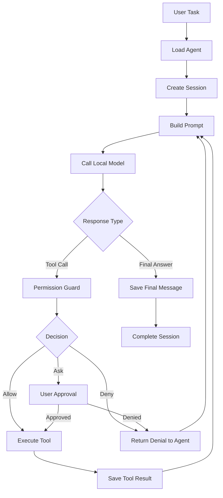
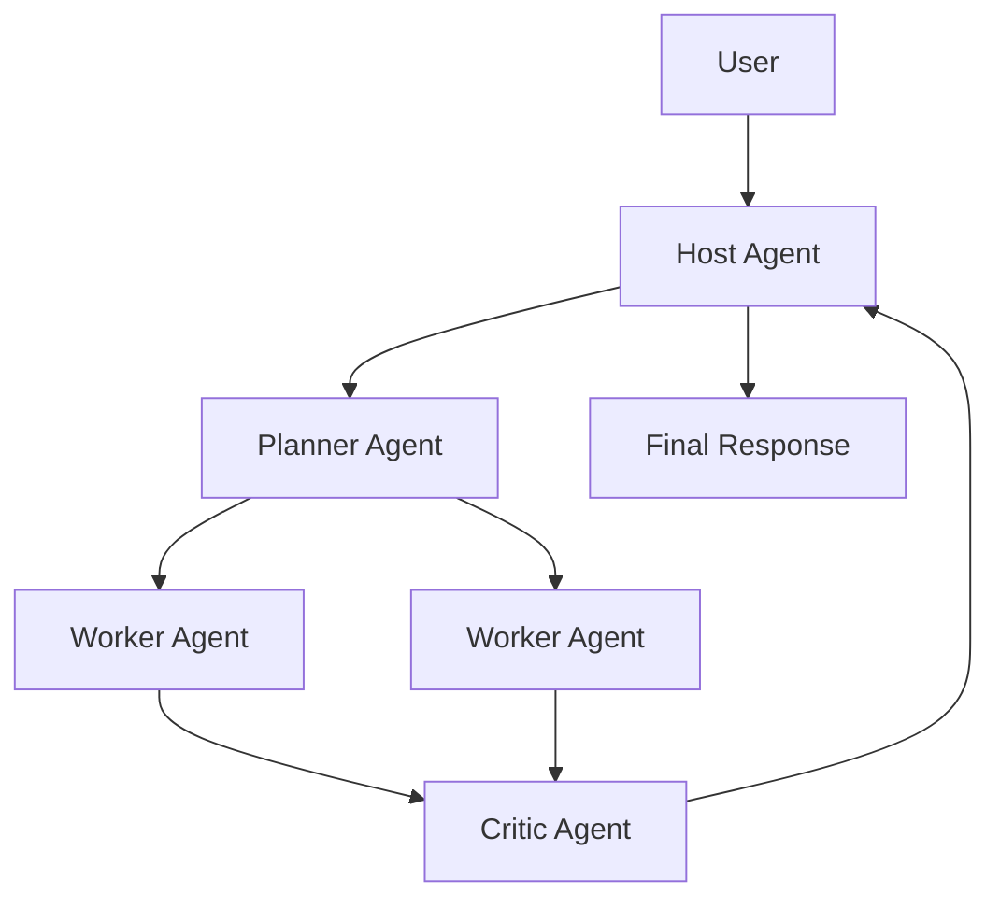
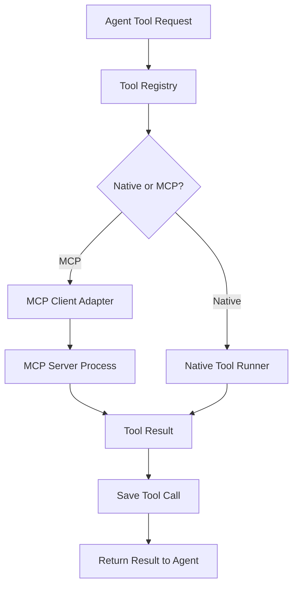
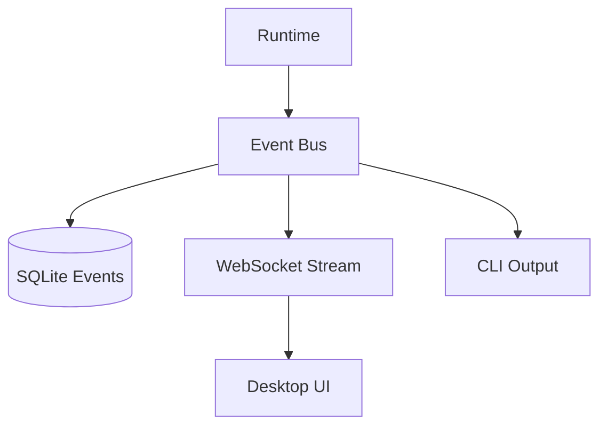
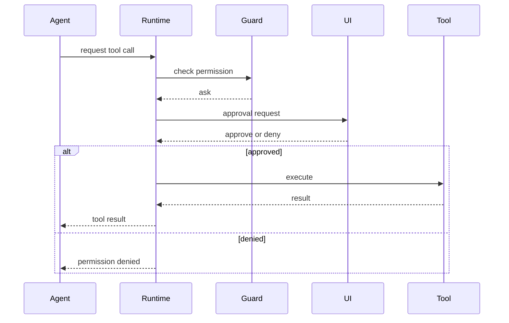
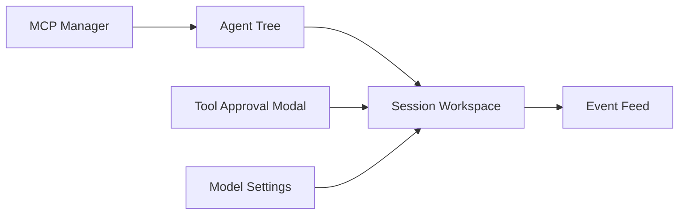

# Flow Diagrams

## Single Agent Flow

```mermaid
flowchart TD
    A[User Task] --> B[Load Agent]
    B --> C[Create Session]
    C --> D[Build Prompt]
    D --> E[Call Local Model]
    E --> F{Response Type}
    F -->|Final Answer| G[Save Final Message]
    F -->|Tool Call| H[Permission Guard]
    H --> I{Decision}
    I -->|Allow| J[Execute Tool]
    I -->|Ask| K[User Approval]
    I -->|Deny| L[Return Denial to Agent]
    K -->|Approved| J
    K -->|Denied| L
    J --> M[Save Tool Result]
    M --> D
    L --> D
    G --> N[Complete Session]
```

## Multi-Agent Flow

```mermaid
flowchart TD
    U[User] --> H[Host Agent]
    H --> P[Planner Agent]
    P --> W1[Worker Agent]
    P --> W2[Worker Agent]
    W1 --> C[Critic Agent]
    W2 --> C
    C --> H
    H --> R[Final Response]
```

## MCP Tool Flow

```mermaid
flowchart TD
    A[Agent Tool Request] --> B[Tool Registry]
    B --> C{Native or MCP?}
    C -->|Native| D[Native Tool Runner]
    C -->|MCP| E[MCP Client Adapter]
    E --> F[MCP Server Process]
    F --> G[Tool Result]
    D --> G
    G --> H[Save Tool Call]
    H --> I[Return Result to Agent]
```

## Event Streaming Flow

```mermaid
flowchart TD
    R[Runtime] --> E[Event Bus]
    E --> DB[(SQLite Events)]
    E --> WS[WebSocket Stream]
    WS --> UI[Desktop UI]
    E --> CLI[CLI Output]
```

## Tool Approval Flow

```mermaid
sequenceDiagram
    participant Agent
    participant Runtime
    participant Guard
    participant UI
    participant Tool

    Agent->>Runtime: request tool call
    Runtime->>Guard: check permission
    Guard-->>Runtime: ask
    Runtime->>UI: approval request
    UI-->>Runtime: approve or deny
    alt approved
        Runtime->>Tool: execute
        Tool-->>Runtime: result
        Runtime-->>Agent: tool result
    else denied
        Runtime-->>Agent: permission denied
    end
```

## Desktop UI Layout

```mermaid
flowchart LR
    A[Agent Tree] --> B[Session Workspace]
    B --> C[Event Feed]
    D[Tool Approval Modal] --> B
    E[Model Settings] --> B
    F[MCP Manager] --> A
```
